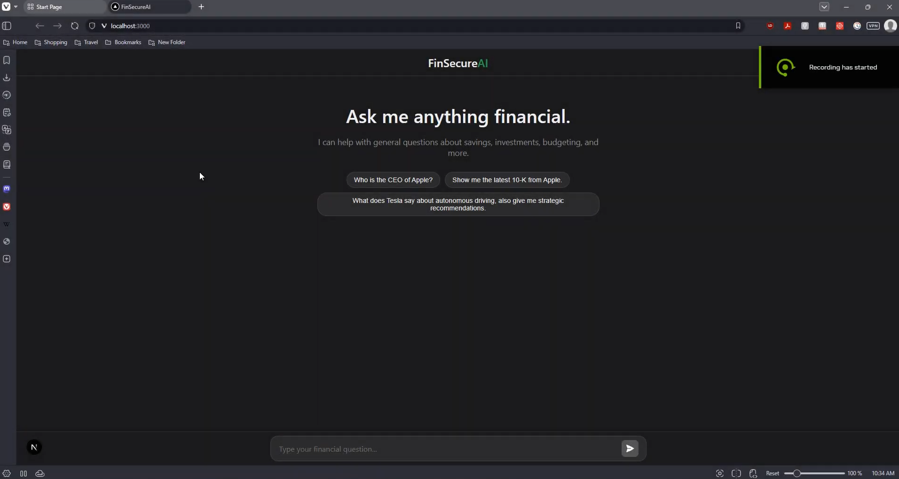

# FinSecureAI: Your Personal AI Financial Analyst 📈

 

FinSecureAI is a full-stack application that transforms dense SEC filings and financial reports into an intelligent, conversational experience. It was born from the idea that financial intelligence should be accessible to everyone, not just experts.

This project represents the **complete, end-to-end lifecycle of a production AI system**. I personally designed and built the entire stack, including:

*   A robust **ETL (Extract, Transform, Load) pipeline** for ingesting and processing terabytes of raw financial data.
*   A sophisticated fine-tuning workflow to create a suite of specialized, custom language models.
*   A scalable backend API and a modern, reactive frontend.
*   Full deployment of the models as a **live inference endpoint on AWS Cloud**, which was later decommissioned to manage operational costs—a practical lesson in the full project lifecycle.

This work is a significant expansion of my **Bachelor's Thesis, for which I earned a 9.85/10**, evolving an academic concept into a fully realized, deployable product.

### 🎥 Video Demo

### 🏛️ High-Level Architecture

I designed this project as a complete MLOps system, separating the offline tasks (data processing, model training) from the online task (serving the API). This is the same principle used to build robust, production-grade AI systems.

---

### 🧠 The AI Engine: A Multi-Step Reasoning Pipeline

To answer complex questions accurately, the system doesn't rely on a single LLM call. Instead, it uses a specialized, multi-step pipeline where each model has a specific job.

#### **1. Intent Classification**
The first step is to understand the user's true goal. The initial query is passed to a fine-tuned **Intent Model** that classifies it into categories like `DOCUMENT_SEARCH`, `MARKET_DATA_ONLY`, or a `HYBRID` of both. This ensures we don't waste time searching documents if the user just wants a stock price.

> **Model Link:** The fine-tuned model for this step is available here: **[SerbanA01/model_classification on Hugging Face](https://huggingface.co/SerbanA01/model_classification)*

#### **2. Intelligent Query Parsing**
Once the intent is known, a second fine-tuned **Metadata Model** parses the query to extract structured information. It identifies crucial details like company tickers (e.g., "Apple" -> "AAPL"), fiscal years, quarters, and report types ("10-K", "earnings transcript"). This structured data is essential for precise document retrieval.

> **Model Link:** The fine-tuned model for this step is available here: **[SerbanA01/model_metadata on Hugging Face](https://huggingface.co/SerbanA01/model_metadata)**

#### **3. Retrieval & Re-ranking**
With the extracted metadata, the **Retriever** queries the Qdrant vector database for the most relevant document chunks. But we don't stop there. The initial results are passed to a powerful **Cross-Encoder Re-ranker Model**, which re-scores the documents based on their semantic relevance to the original query, ensuring only the highest quality context is used.

#### **4. Synthesized Generation**
Finally, the refined context, the original query, and a carefully crafted prompt are sent to the fine-tuned **Final Answer Model**. This model's sole purpose is to synthesize all the information into a coherent, accurate, and easy-to-read answer.

> **Model Link:** The fine-tuned model for this step is available here: **[SerbanA01/model_answer on Hugging Face](https://huggingface.co/SerbanA01/model_answer)**

---

### 🔥 The Fine-Tuned Brain: Optimizing Llama 8B

Off-the-shelf models are powerful, but they lack deep financial domain knowledge and are too resource-intensive for practical use. I solved this by fine-tuning Llama 8B using several key techniques.

#### **Synthetic Data Generation**
The biggest challenge in fine-tuning is getting high-quality training data. I addressed this in my `pipelines` by building a script (`8_generate_synthetic_qa.py`) that uses a powerful LLM to read through document chunks and generate realistic question-and-answer pairs. This created a rich, domain-specific dataset that was crucial for teaching the models the nuances of financial language.

#### **LoRA (Low-Rank Adaptation)**
Full fine-tuning of a model like Llama 8B is computationally impossible without a datacenter. I used LoRA to update only a tiny fraction of the model's weights. This made the fine-tuning process incredibly efficient, allowing me to train all three specialized models on a single GPU.

#### **4-bit Quantization**
To run these models for live inference, they need to fit in memory. By using 4-bit quantization, I compressed the model's weight from 16-bit floating point numbers down to 4-bit integers.

### 📂 Repository Structure

This project is architected with a clear separation between offline data processing and the online API, a best practice for building maintainable MLOps systems.

-   **/pipelines**: Contains the master scripts for the entire data-to-model workflow. These are designed to be run sequentially to ensure reproducibility. They handle everything from downloading SEC filings (`1_download_sec_filings.py`) to generating synthetic training data (`8_generate_synthetic_qa.py`) and fine-tuning the final models (`10_finetune_model.py`).

-   **/src**: This is the core logic library of the project. It contains all the reusable functions and classes for data processing, partitioning, and the RAG pipeline itself. The scripts in `/pipelines` import and use this code, ensuring our logic is centralized and not repeated.

-   **app.py**: A lean, high-performance FastAPI server that serves the live application. It's responsible for loading the trained models into memory once at startup for efficiency and exposing a simple `/ask` endpoint. It calls the main `get_rag_response` function from the `/src` library to do the heavy lifting.

-   **/ragwebapp**: The complete frontend application built with React and Next.js, which communicates with the API provided by `app.py`.

###  Key Features

*   **Conversational AI Chat:** Ask complex questions like *"What were Apple's main revenue drivers in Q4 2022?"* or *"Compare Tesla's and Ford's outlook on autonomous driving."*
*   **Retrieval-Augmented Generation (RAG):** The AI doesn't hallucinate. It grounds its answers in data retrieved from a comprehensive knowledge base of 10-K, 10-Q, and earnings call transcripts.
*   **Custom Fine-Tuned Model:** Utilizes a Llama-8B model fine-tuned with LoRA on a custom financial dataset for superior domain-specific understanding.
*   **Real-Time Market Data:** Integrates with yfinance to provide up-to-date stock prices, market cap, and other key metrics.

---

### 🛠️ Tech Stack

| Area      | Technologies                                                                                           |
| :-------- | :----------------------------------------------------------------------------------------------------- |
| **Frontend** |    |
| **Backend**  |   |
| **AI/ML**    |   **(Transformers, LoRA, Quantization)** |
| **Database** |  (Vector DB)  |
| **DevOps**   |   **(Inference Endpoints)**  |

---

### 🎯 Challenges & Learnings

This project was a journey of solving real-world engineering problems.

-   **The "Smart but Broke" Problem:** The biggest challenge was getting state-of-the-art AI performance on a budget. This forced me to go deep into model optimization, learning that the combination of **synthetic data, LoRA, and quantization** is a game-changer for building powerful, practical AI systems.
-   **Beyond the "One-Model-to-Rule-Them-All" Myth:** My initial attempts with a single RAG model gave generic answers. I learned that complex reasoning requires a **pipeline of specialized models**, each an expert at its own task. This modular approach was key to achieving high accuracy.
-   **From `localhost` to the Cloud:** I successfully configured and deployed the entire stack to **AWS, serving the models via a dedicated inference endpoint**. This experience provided invaluable lessons in cloud architecture, IAM roles, and, crucially, **cloud cost management**, leading to the strategic decision to decommission the endpoint after the proof-of-concept phase. This taught me that a project isn't "done" until it's deployed, and it isn't successful until it's sustainable.

### ⚠️ Disclaimer for Educational Showcase

This repository and its contents are intended for **educational and demonstration purposes only**.

*   **Not Financial Advice:** The outputs generated by the AI are for informational purposes only and **do not constitute investment advice, financial advice, or trading advice**.

*   **For Technical Demonstration:** The primary purpose of this project is to showcase the architecture, techniques, and engineering challenges involved in building a complex, end-to-end RAG system. The code is a demonstration of what is possible, not a source of financial truth.

*   **Project Name & Non-Affiliation:** The name "FinSecureAI" is used for project identification purposes only. This is **not a commercial product or brand**. No affiliation with any existing companies or entities is intended or implied. The author shall not be held liable for any confusion or legal issues.
